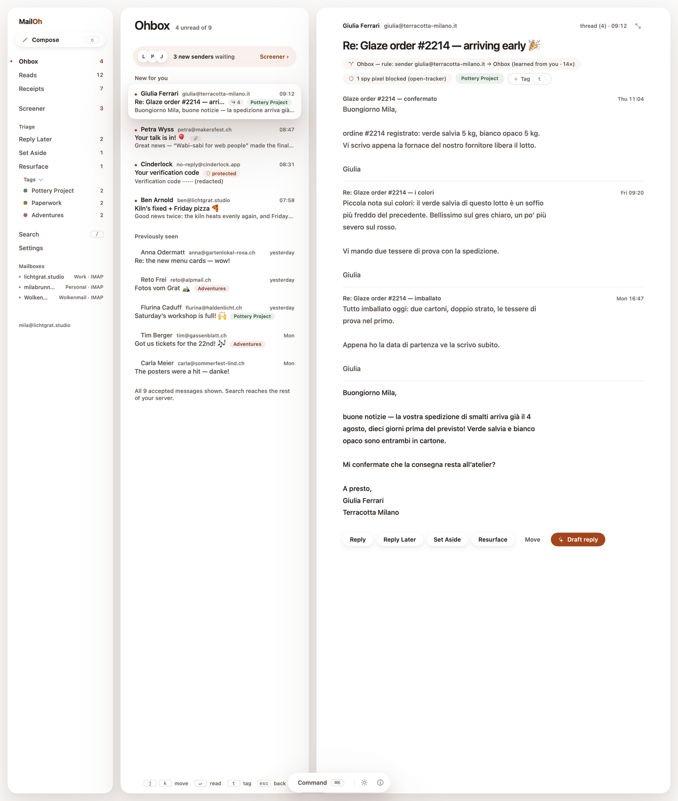
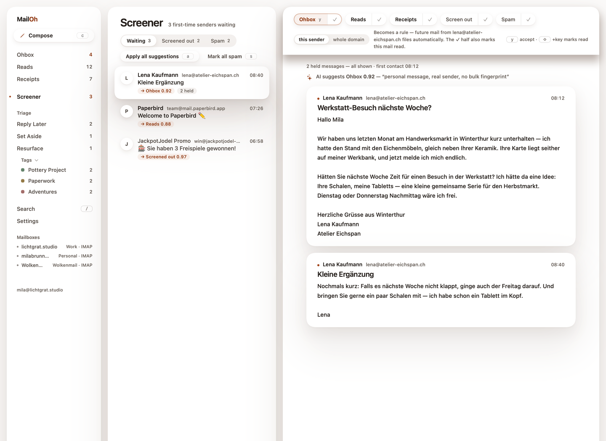
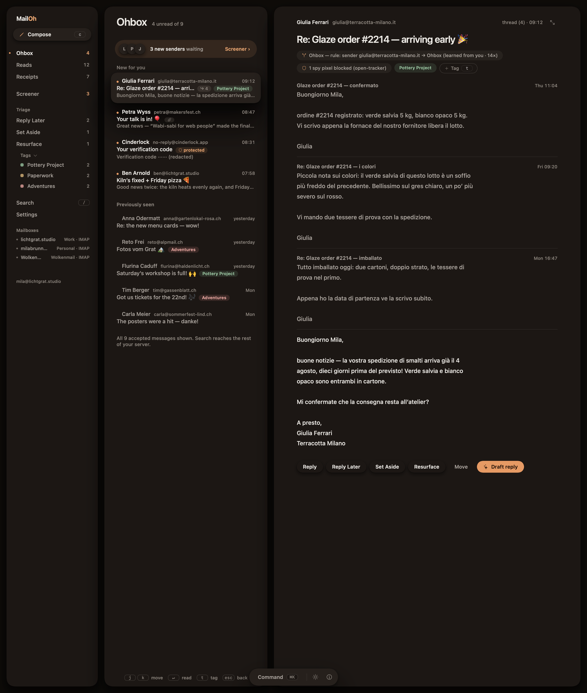
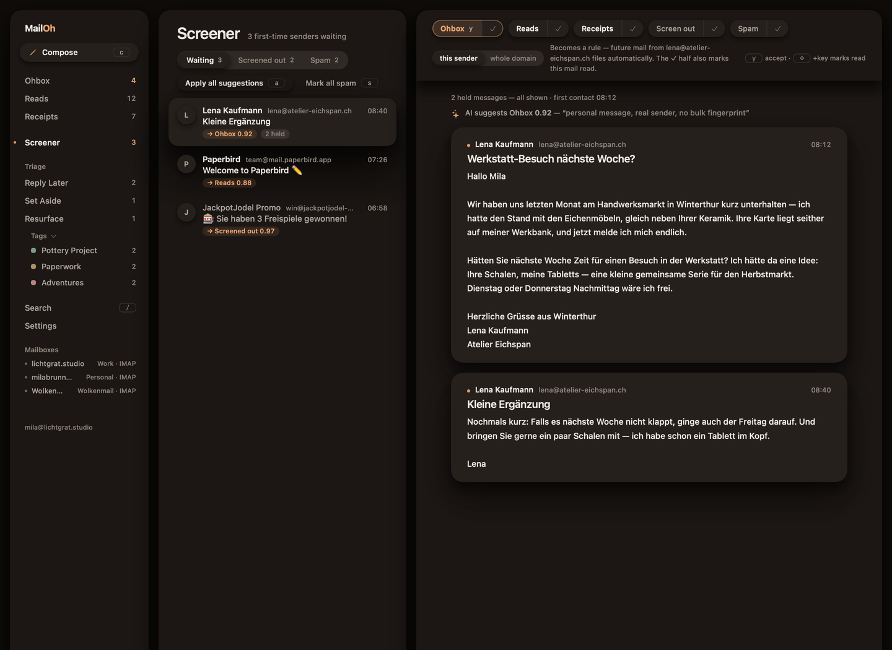

<div align="center">


# ohmail for the desktop

**Consent-first email, on the mailboxes you already have.**

A native SwiftUI client for macOS and a Tauri shell for Windows and Linux.
Free, GPL-3.0, no account, no subscription — this repository is the whole thing.

[](https://github.com/trafficflowhq/ohmail/actions/workflows/build.yml)
[](https://github.com/trafficflowhq/ohmail/releases/tag/v0.6.0)
[](LICENSE)
[](#macos)
[](#windows)
[](#linux)
[](https://ohmail.app)

</div>

---

## What this repository is

**ohmail is email that asks your permission before it takes your attention.** A
first-time sender waits in the Screener until you say where they belong; after
that the Ohbox holds only people you said yes to, newsletters skim past in Reads,
and receipts file themselves. It runs on the mailbox you already have — any IMAP
provider — and organises it **in place**, in real folders on your real server, so
leaving costs you nothing.

**This repository is the free ohmail desktop apps** — macOS, Windows and Linux.
All of them, all of their source, under GPL-3.0. **The macOS build now carries the
local mail engine and connects to a real mailbox**; the Windows and Linux builds
are still an interface preview while the engine is ported to their shell — see
[Status](#status--read-this-first). There is no paid edition of the desktop app,
no feature held back for one, and no telemetry reporting back on you.

**ohmail Cloud is the optional hosted half, and it is what pays for this one.**
Your phone cannot hold a connection to your mailbox open all day; something has
to stay awake to notice new mail, run it past the Screener and file it. Cloud is
that work done on a machine that never sleeps, plus the web and mobile apps and
push. It is a commercial service with a codebase of its own, built by the same
people, and the desktop app neither asks for it nor needs it.
[Desktop or Cloud](#desktop-or-cloud) is the full comparison, prices included.

## The current release — v0.6.0

**[Download it here.](https://github.com/trafficflowhq/ohmail/releases/tag/v0.6.0)**
`ohmail.dmg` for macOS, an `.msi` and an NSIS `-setup.exe` for Windows, an
`.AppImage` and a `.deb` for Linux. Every file was built by GitHub Actions from
the tree this tag points at, and the run that made them prints the SHA-256 of
each one. Nothing is signed on any platform — see the per-platform install notes
under [Download a build](#download-a-build) before you double-click anything.

**macOS is now a working mail client.** The `.dmg` carries the local mail engine:
it connects to your own IMAP mail server over TLS, mirrors your mailbox to a local
database on your Mac, and organises new mail into `ohmail/` folders on the server
itself — a Screener for first-time senders, Reads, Receipts, and the rest — so the
filing is visible in every other mail app you own. It asks for your server and
password on first launch; the password is sealed under a per-install key in your
login Keychain. In this **local mode** nothing leaves your Mac but the IMAP
connection to your provider, the signed update check, and — only if you turn it on
— your own AI key or a local Ollama: no telemetry, no analytics. You can instead
sign in to **ohmail Cloud** (the optional hosted service) and use the app as a
viewer of a mailbox Cloud already organises; that mode connects to ohmail.app, and
your session is held in memory only. To look around **without** connecting
anything, launch the built-in fixture world instead:

    open -a ohmail --args --demo

**Windows and Linux are still an interface preview.** The Tauri shell renders every
screen of the product on that same small fictional mailbox, but it does not connect
to a mailbox: the engine is macOS-only for now, and the shell forbids network access
at the webview level. The port is
[issue #1](https://github.com/trafficflowhq/ohmail/issues/1).

**What is new since v0.4.0-preview:** the app now checks for updates and installs them on
your word, with the downloaded payload cryptographically verified before it runs — Sparkle on
macOS, minisign on Windows and Linux. macOS gains two-door onboarding (set up a mailbox with a
provider app password, or sign in to ohmail Cloud and read your mail over HTTPS), local SMTP
send, a title bar merged into the window, and a network-egress allow-list.
[CHANGELOG.md](CHANGELOG.md) has the detail.

v0.1.0-preview shipped under the earlier name `mailoh` and its files are still
named that way; they were not relabelled, because renaming a released file
invalidates every checksum published against it. [CHANGELOG.md](CHANGELOG.md) has
the full list.

## Status — read this first

**macOS is a working mail client; Windows and Linux are still an interface preview.**
The macOS `.dmg` connects to your IMAP mailbox and organises it in place; the Tauri
builds render the whole interface on a small fictional mailbox that ships inside the
app and connect to nothing.

| | macOS | Windows / Linux |
|---|---|---|
| **Connects to your mailbox** | ✅ Yes. The bundled engine speaks IMAP over TLS, mirrors your mailbox to a local store, and files new mail into `ohmail/` folders on your server. | ❌ Not yet. The shell forbids connections at the webview level (`connect-src 'none'`) and replaces `fetch` / `XMLHttpRequest` / `WebSocket` with functions that throw. |
| **What it talks to** | Local mode: your IMAP server, the signed update feed, and — only if you turn it on — your own Anthropic key or a local Ollama. Cloud mode: ohmail.app, the hosted service you sign into, as a viewer. No telemetry, no analytics. | Nothing. No network at all. |
| **Credentials** | Your mail password, sealed under a per-install key in your login Keychain, never written in the clear. | None — there is nothing to sign into. |
| **Try it without a mailbox** | `open -a ohmail --args --demo` runs the built-in fixture world — no server, no network, no account. | The fixture world is what the app shows. |
| **Runs, and is worth looking at** | Every surface is real: Ohbox, Screener, Reads, Receipts, triage piles, tags, search, compose, settings — light and dark, down to a 390 pt window, keyboard-first, native SwiftUI. | The same interface, in a locked-down webview. |
| **Tested** | The interface model, the rules and design tokens, and the engine's sync, lease and organise logic are covered by the test suite; the packaging job boots the shipped bundle to prove it starts; and the release engine was verified connecting to and organising a real IMAP mailbox. | A 31-check render + offline audit over the built bundle, and 14 assertions on the security configuration. |
| 🔜 Next | A signed, notarised build with a real Apple Developer ID — this one is ad-hoc-signed, so first launch needs the Gatekeeper approval in the install notes. It already updates itself over a signed feed. | The engine port, so the shell connects too — [issue #1](https://github.com/trafficflowhq/ohmail/issues/1). |

If you came here from [ohmail.app](https://ohmail.app): the macOS build reads and
organises your mail today. Watch the repository for the Windows and Linux engine, or
ask us at support@ohmail.app.

## What ohmail is

Email that asks your permission before it takes your attention, built **on your
existing mailboxes** — any IMAP provider — and organising them **in place**, in
real folders on the real server. Leave whenever you like; your mailbox stays
organised.

- **Screener** — nobody reaches you twice by default. First contact waits, with
  every held message shown in full, and you send the sender somewhere: Ohbox,
  Reads, Receipts, screened out, spam. The choice becomes a rule.
- **Ohbox** — the inbox, after the Screener has done its work. Only mail from
  people you said yes to.
- **Reads** — newsletters in a skim stream with a seen-waterline, so a week away
  costs you nothing.
- **Receipts** — orders, confirmations, tickets. Filed, not read.
- **Triage piles** — Answer Later, Parked, and **Resurface** for mail that
  should come back at a chosen time.
- **Tags, never folders** — cross-cutting, and applied on top of the one place a
  message actually lives.
- **Organise in place** — every decision lands as a real folder on your real
  server, readable by every other mail app you own. There is no export step,
  because there is nothing to export.
- **Spy pixels blocked** — the tracking pixels that tell a sender when you opened
  their mail, and where, do not load.
- **AI proposes, you decide.** Suggestions are preselected, never applied.
  Nothing sends itself. One-time codes and login links are structurally excluded
  from anything AI touches — in this codebase a protected message has *no body
  field to leak*.

## Screenshots

Rendered from this source tree by `swift run OhMail --shot`, unretouched.

**Ohbox** — a thread, its rule provenance, the blocked tracking pixel, the tags.



**Screener** — a first-time sender who is a person rather than a list: two held
messages, both shown in full, one suggested destination, five to choose from, and
the keys that pick them. (In this preview the suggestion is a fixture, not a live
model — see [Status](#status--read-this-first).)



<details>
<summary><strong>Dark mode</strong> (same two surfaces)</summary>




</details>

All of it is fictional mail from a fictional persona. No real people, no real
brands, no scraped inboxes.

## Download a build

**[Releases](https://github.com/trafficflowhq/ohmail/releases) is the place to
start** — the installers are attached there, they need no GitHub account, and
each release names the run that built it. (Every release so far is marked a
pre-release, which is accurate and which is why `/releases/latest` does not
resolve to one: GitHub reserves that address for stable releases, and there has
not been one yet.)

Every push to `main` also builds all three platforms and attaches the installers
to that run: [latest builds →](https://github.com/trafficflowhq/ohmail/actions/workflows/build.yml).
That is how to get a build newer than the last release. The artifact list is at
the bottom of a run page and GitHub requires you to be signed in to download from
there. **Each run's summary prints the SHA-256 of every artifact it produced**,
plus the toolchain and the runner, so you can check what you downloaded against
what the run made.

| Platform | Artifacts | Runner |
|---|---|---|
| **macOS** | `ohmail.dmg` (universal, arm64 + x86_64, **engine-bearing**), `ohmail.app.zip`, the full screenshot set | `macos-15` |
| **Windows** | `ohmail_0.6.0_x64_en-US.msi`, `ohmail_0.6.0_x64-setup.exe` (NSIS) | `windows-latest` |
| **Linux** | `ohmail_0.6.0_amd64.AppImage`, `ohmail_0.6.0_amd64.deb` | `ubuntu-latest` |

**Nothing here is signed**, on any platform. Code-signing certificates cost money
ohmail has not spent yet. We would rather say that plainly than have you discover
it from a scary dialog. On all three platforms, building from source is the
option that requires trusting nobody.

### macOS

> [!IMPORTANT]
> **The DMG is unsigned and un-notarized.** It carries an ad-hoc signature only,
> not an Apple Developer ID. On first launch macOS Gatekeeper will refuse a
> double-click and may claim the app "is damaged". It is not.
> **Right-click (or Control-click) ohmail.app → Open → Open.** The same note is
> in the DMG as *Read me first.txt*. Signed and notarized builds land with the
> developer account.

Requires macOS 15 (Sequoia) or newer.

### Windows

> [!IMPORTANT]
> **No Authenticode signature.** SmartScreen will show "Windows protected your
> PC" on first run. **More info → Run anyway.** The NSIS installer installs
> per-user, so it needs no administrator; the `.msi` is there for anyone who
> deploys that way.

> [!IMPORTANT]
> **The installers do not download WebView2 — and that is deliberate.** Tauri's
> default is to compile a downloader into the `.msi` and the `.exe` that fetches
> the runtime from `go.microsoft.com` during installation. We set
> `webviewInstallMode: skip` and took it out, because an installer that opens a
> connection makes "it cannot reach the network" a footnote instead of a fact.
> The trade is that **you must already have WebView2.** Windows 11 has it;
> so does any Windows 10 that has taken updates since 2021, because Edge
> installs it. If yours does not, ohmail will not start and will tell you so —
> install the Evergreen runtime once, from Microsoft:
> <https://developer.microsoft.com/microsoft-edge/webview2/>

Requires Windows 10 or newer, plus the WebView2 runtime as described above.

### Linux

> [!IMPORTANT]
> **The AppImage needs the executable bit**, which GitHub's artifact zip does not
> preserve:
> ```bash
> chmod +x ohmail_0.6.0_amd64.AppImage && ./ohmail_0.6.0_amd64.AppImage
> ```
> If it exits immediately on a distribution that has not enabled unprivileged
> user namespaces, run it with `--appimage-extract-and-run`.

The `.deb` installs with `sudo apt install ./ohmail_0.6.0_amd64.deb` and pulls in
WebKitGTK. It is **not** in any repository, and a `.deb` install cannot replace
itself in place, so it does not auto-update — the AppImage is the Linux build that
applies its own updates, from the same signed feed the app checks.

To uninstall it: `sudo apt remove ohmail`. The Debian package name, the binary at
`/usr/bin/ohmail`, the icon and the launcher entry are all the same word.

### Verify it yourself

On Windows and Linux the interface is embedded **uncompressed** on purpose, so
you can check what a downloaded binary does without running it:

```bash
strings -a ohmail.exe | grep -oE 'https?://[A-Za-z0-9._~:/?#@!$&()*+,;=%-]+' | sort -u
strings -a ohmail.exe | grep -c Ohbox      # the interface really is in there
```

The first command prints **14 strings on Linux, 15 on Windows**, and every one
of them is one of four things: an XML namespace constant React compares against,
a documentation link inside a panic or error message, Microsoft's own WebView2
download page (see the Windows note above), or — three of them — an artifact of
grepping a Rust binary, where `"http://"` is a string literal that sits in
read-only data with no terminator between it and whatever was placed next to it.
`apps/desktop/README.md` lists all fifteen, one by one, with the full
surrounding line for the three that are not URLs at all.

CI runs exactly these greps on every build, prints the complete list in the job
log, **asserts the count** so that "14 and 15" cannot quietly stop being true,
and **fails the run** if any URL in the binary points at ohmail or TrafficFlow
infrastructure. It also fails the Windows job if the `.msi` or the `-setup.exe`
contains a WebView2 downloader.

## Build it yourself

### macOS

**Requirements:** macOS 15 (Sequoia) or newer, and Xcode for the Swift 6
toolchain and the macOS SDK (`xcode-select --install` on its own is not enough).
Built and tested on every push with **Xcode 26.3 / Swift 6.2.4** on macOS 15 —
that is the combination we can vouch for; Swift 6.0 (Xcode 16) is the language
mode the package declares and should work, but is not covered by CI.

No dependencies: `Package.swift` declares zero third-party packages, so there is
nothing to resolve, install or trust.

```bash
git clone https://github.com/trafficflowhq/ohmail
cd ohmail

swift build --package-path apps/macos -c release   # ~15 s cold on an M-series Mac
swift test  --package-path apps/macos              # 269 tests
swift run   --package-path apps/macos OhMail       # opens the app
```

Two extra entry points, both used by CI:

```bash
# Render check: every route × light/dark × 1440 pt and 390 pt, hosted offscreen,
# rasterised, and audited — including that no message was replaced by a "N more"
# placeholder. Prints "SMOKE OK (110 checks)" and exits 0.
swift run --package-path apps/macos OhMail --smoke

# Screenshots of every route, both schemes, both widths, as PNGs.
swift run --package-path apps/macos OhMail --shot shots
```

And an installable bundle, which SwiftPM cannot make on its own:

```bash
./scripts/package-app.sh     # → build/ohmail.app and build/ohmail.dmg
```

### Windows and Linux

**Requirements:** [Rust](https://rustup.rs) (stable) and Node 22. On Linux also
the Tauri prerequisites — on Ubuntu 24.04:

```bash
sudo apt-get install -y libwebkit2gtk-4.1-dev libgtk-3-dev libsoup-3.0-dev \
  libjavascriptcoregtk-4.1-dev librsvg2-dev libayatana-appindicator3-dev \
  libssl-dev build-essential curl wget file patchelf desktop-file-utils
```

On Windows, the MSVC build tools and WebView2.

```bash
cd apps/desktop
npm install
npm run ui:build      # → dist/, the bundle the app embeds
npm run smoke         # → SMOKE OK (31 checks) — renders, and proves it is offline
npx tauri build       # → src-tauri/target/release/bundle/…
```

`apps/desktop/README.md` is the long version: why the UI is bundled with Vite
rather than exported from Next, what each of the three aliases does, and the
complete capability and CSP set.

### It cannot reach the network

Not "does not" — cannot, in three independent ways. The webview's
Content-Security-Policy is `connect-src 'none'`, so `fetch`, XHR, WebSocket and
EventSource are refused before they are attempted. The page then replaces those
APIs with functions that throw. And the Cloud sync client is aliased out of the
bundle at build time — it is not compiled in, and its source is not in this
repository at all. The Tauri capability list is literally empty
(`"permissions": []`): the interface can call no Tauri command, touch no file and
spawn no process.

**The installers do not either**, which is a separate claim and worth stating
separately, because it was not true of the first build we made. Tauri ships a
`downloadBootstrapper` by default: a WiX custom action in the `.msi` and an
NSISdl step in the `-setup.exe` that fetch the WebView2 runtime from
`go.microsoft.com` if the machine lacks it. Both are gone —
`webviewInstallMode: skip`, asserted by CI against the built installers rather
than trusted from the config — and the cost is that you supply WebView2
yourself. See the Windows note above.

## Desktop or Cloud

ohmail comes in two halves, and **this repository is the whole of the first
one**. Here is the honest comparison, including the parts where Desktop wins.

The Desktop column describes what the local engine makes possible. On **macOS** that
engine now ships and these rows are real; the **Windows and Linux** builds are still
the interface on a fictional mailbox until the engine is ported to their shell (see
[Status](#status--read-this-first)). Rows marked 🔜 are the ones the Windows and Linux
builds are still waiting on.

|  | **Desktop** — this repository | **Cloud** — optional |
|---|---|---|
| **Price** | **Free, forever.** Not a trial, not a freemium tier. | $9 / $15 / $29 per month |
| **Mailboxes** | As many as you like (🔜 on Windows/Linux) | 5 / 10 / 50 |
| **Where your mail is processed** | **Your machine. Only.** It never touches our servers — there is no server to touch. (🔜 on Windows/Linux) | EU-hosted: a full copy of your mail, encrypted at rest, **not** end-to-end — solely to serve you, deletable |
| **Account** | **None.** Nothing to sign up for, nothing to cancel. | Yes |
| **AI** | Bring your own Anthropic key, or run a local model such as [Ollama](https://ollama.com) so nothing leaves your machine at all. Ships in the macOS build, off unless you turn it on (🔜 on Windows/Linux). | A monthly allowance of managed AI actions (~2k / 6k / 20k). 🔜 No live model is connected in production yet either; the metering that governs it is. |
| **Web and mobile apps** | — | Yes |
| **Push notifications** | — | Yes |
| **Works while your laptop is shut** | — | Yes — mail is screened and filed as it arrives |
| **Open source** | **GPL-3.0. All of it, right here.** | No |

### Why a Cloud exists at all

Not to unlock features. Your phone cannot hold a connection to your mailbox open
all day — the battery and the operating system will not allow it. Something has
to stay awake to notice new mail, run it past the Screener and file it. On
Desktop that something is your computer, while it is on. Cloud is that same work,
done on a machine that does not sleep.

**The Screener, the Ohbox, the tags and the organise-in-place model are identical
on both — the privacy posture deliberately is not.** That is the axis of the whole
table above: Desktop is designed so your mail never leaves your machine, while
Cloud necessarily holds a copy of it to deliver push, mobile and search. Both are
honest positions; they are not the same position, and picking between them is the
point.

Desktop is not *planned* as a demo of Cloud — it is a complete product on its own. On
macOS that is true today; the Windows and Linux builds still run on fixtures, so
"preview" remains the fair word for those until the engine reaches them.

### If you do want Cloud

- **14 days free, no card.** The trial runs **rules-only** — the whole product
  except the managed AI actions, which begin when a subscription does.
- **Run out of AI actions and mail keeps flowing, rules-only,** until the next
  cycle. There are no overage charges, ever. We would rather degrade than
  surprise you with a bill.
- **Leave whenever.** Your mail was organised in place, in real folders on your
  own server, the entire time. There is no export, because there is nothing to
  export — cancel and your mailbox stays exactly as organised as it was.

Details and sign-up: **[ohmail.app](https://ohmail.app)**. And if the answer is
"the free desktop app is fine, thanks" — genuinely, that is a good outcome. It is
why we built it this way.

## How it is put together

Two clients, one interface. The macOS app is native SwiftUI; the Windows/Linux
app is a Rust window around the React implementation of the same design system.
Neither is a port of the other — they are two renderings of one specification,
and the parts that could drift (colours, radii, spacing, shadows) are compared
numerically against the same token file by the Swift test suite.

### macOS — `apps/macos`

7,600 lines of Swift across 30 files plus 1,400 lines of tests, one SwiftPM
package, no dependencies.

| Target | Kind | What is in it |
|---|---|---|
| `OhMailKit` | library | `Theme/` (the design tokens), `Models/`, `Fixtures/`, `State/`, `Views/`, `App/` |
| `OhMail` | executable | `main.swift` — dispatches `--smoke`, `--shot`, or the app |
| `OhMailKitTests` | tests | 157 tests: counts and seen-semantics, lossless Screener moves, undo, triage, tags, search, numeric design-token fidelity, source audits, and the no-collapse audit |

One of those 99 reports as *skipped* here, and says why when it does: it compares
the triage pile's sheet-edge shadow against the original design prototype, which
is not published. It runs in the monorepo, where it once caught a shadow that had
drifted from `.10` to `.16` alpha.

### Windows and Linux — `apps/desktop`

Eleven lines of Rust, and a 330 KB bundle.

| Piece | What is in it |
|---|---|
| `src-tauri/src/main.rs` | the whole Rust side: create the window, run. No commands, no plugins, no `std::fs`, no `std::net`. |
| `src-tauri/tauri.conf.json` | window geometry (clean to 390 px), the CSP, the bundle targets, the `oh.` icon family |
| `src-tauri/capabilities/main.json` | one file, `"permissions": []` |
| `src/` | the desktop-specific layer: providers, the pre-paint theme stamp, the offline guard, and the two stubs that stand in for the Cloud sync client and the Cloud API client |
| `packages/{tokens,ui,fixtures,client-engine}` + `apps/webapp/app/{shell,views,components}` | the interface itself — the same sources the web client renders, compiled by Vite into the bundle Tauri embeds |

`apps/webapp/app/` here is **only** the client shell, its views and the components
they compose. The Cloud web app's sign-in, its API topology and its server-side
plumbing are not in this repository, and neither is the `/sync` protocol client
nor the Cloud API client. Each of those two resolves to a stub, so the tree
compiles and the bundle can reach neither: the sync client throws on any use, and
the API client throws on every call but answers plainly that no Cloud is
configured — which is what the shared sources ask it before they act, and what
lets them skip a Cloud path instead of crashing on one.

Worth knowing if you plan to read the code:

- **`AppState` is the only thing views may touch.** No view imports fixtures; a
  test fails the build if one does.
- **Every colour and shadow comes from `Theme/`.** `Palette` converts the
  authored OKLCH values to sRGB with Ottosson's matrix so the native app and the
  web design system resolve to the same pixels; `Lift` holds the whole shadow
  vocabulary. A hand-written `OKLCH(` or `.shadow(` inside `Views/` fails the
  suite — that is how a drifted shadow was caught.
- **`--smoke` is the interesting test.** It proves three separate things per
  route: that it lays out, that it actually *draws* (bitmap sampled for ink and
  distinct colours), and that every message the state says exists was built by a
  real row view. The harness is itself mutation-tested: a flat bitmap must fail
  the blank check, and a deliberately collapsing list must fail the row audit.
- **Compact layout is not an afterthought.** `RootView` measures itself and
  publishes `compactLayout` at ≤ 900 pt; the rail becomes a drawer, panes
  collapse per view, and `--smoke` walks every route at 390 × 844 in both
  schemes.

`apps/macos/README.md` is the long version: the architecture, every invariant and
where it is enforced, the two instrumentation approaches that were tried and
abandoned, and the one deliberate divergence from `NavigationSplitView`.

This tree is a generated mirror of a private monorepo (the Cloud backend lives
there and stays there). Commits arrive as syncs that name the monorepo revision
they came from; pull requests land in the monorepo and come back out here.

## Roadmap

1. **The engine on Windows and Linux.** The mail engine — IMAP (IDLE, delta fetch,
   per-mailbox sequence), an on-device store, and the rules pipeline behind
   `AppState`, moving real folders in place with a desired-state model that makes a
   half-moved mailbox impossible — shipped in the macOS build in 0.4.0. Next is
   porting it to the Tauri shell so the Windows and Linux builds connect too.
2. **Signed installers** — a notarized DMG with a real Apple Developer ID, an
   Authenticode-signed .msi and .exe, and automatic updates.
3. **AI, on by default** — Screener suggestions and draft replies via your own API
   key or a local Ollama ship off-by-default on macOS today; making them a
   first-class part of the flow is the remaining work. Proposed, never applied;
   sensitive mail structurally excluded.

Dates are not promised. The order is. Each of these is an open issue with the
detail in it, and [CHANGELOG.md](CHANGELOG.md) records what has actually shipped.

## Licence

GPL-3.0-or-later. Copyright © 2026 **TrafficFlow GmbH**, Staubstrasse 1, 8038
Zürich, Switzerland.

The desktop client is free and is meant to stay free: GPL-3.0 means anyone can
use, study, change and share it, and any redistributed change comes back under
the same terms — so a closed-source re-skin of ohmail is not possible. Full text
in [LICENSE](LICENSE) — a verbatim copy of the FSF's GPL-3.0 — and the reasoning,
the third-party position and the per-file-header decision in
[COPYRIGHT](COPYRIGHT).

**The code is free; the name and the icon are not.** You may fork, build and
redistribute this source; a fork you publish needs its own name and its own
artwork, so nobody is misled about who supports it.
[TRADEMARK.md](TRADEMARK.md) is the policy, and it is more permissive than you
probably expect — packaging ohmail for a distribution under its own name is
explicitly fine.

Contributions need **no CLA and no copyright assignment**, just a DCO sign-off
(`git commit -s`) — see [CONTRIBUTING.md](CONTRIBUTING.md), which is also honest
about the one part of the tree where GPL-only contributions constrain us.
Security reports: [SECURITY.md](SECURITY.md).

---

<div align="center">

[ohmail.app](https://ohmail.app) · [issues](https://github.com/trafficflowhq/ohmail/issues) · support@ohmail.app

Built in Zürich by [TrafficFlow GmbH](https://trafficflow.ch).

</div>
